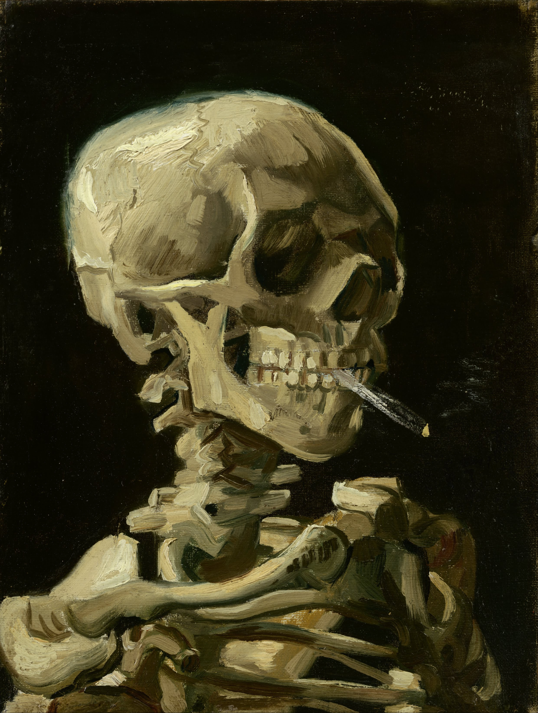
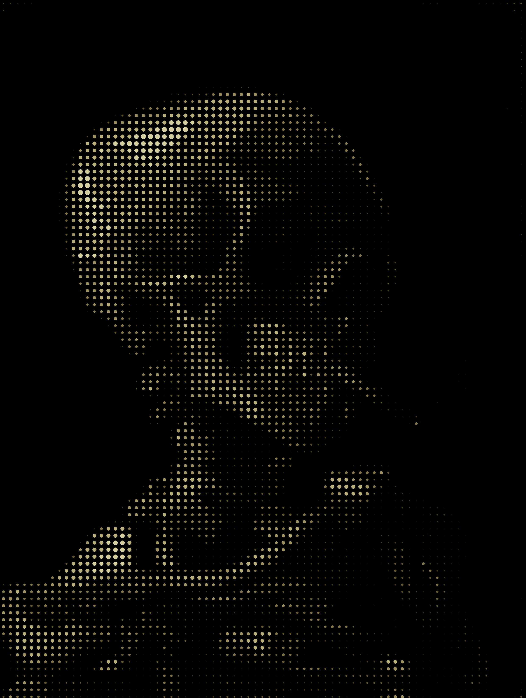
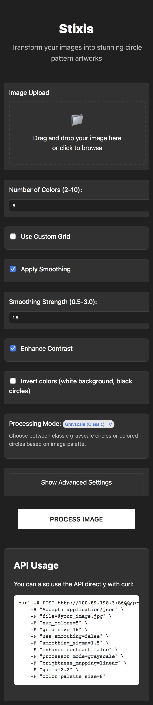

# Stixis - Circle Pattern Generator

Stixis is a Python-based image processing tool that transforms images into artistic circle patterns. It offers both a web interface and command-line functionality.

_Try it out at [https://stixis.onrender.com/](https://stixis.onrender.com/)_

**Note:** The current deployment is using a free tier of Render, so it may take a few seconds to start up.

## Examples

### The Skeleton Smoking Cigarette Transformation
<div align="center">
  <table>
    <tr>
      <td></td>
      <td></td>
    </tr>
    <tr>
      <td><i>Original: Skeleton Smoking Cigarette - Vincent van Gogh</i></td>
      <td><i>Stixis Interpretation</i></td>
    </tr>
  </table>
</div>

### Web Interface



## Features

### Basic Controls
- Adjustable number of circle sizes (2-10)
- Output quality settings (1x, 2x, 4x, 8x)
- Custom grid size option (4+)
- Smoothing with adjustable sigma
- Contrast enhancement
- Color inversion (black/white background toggle)
- Transparent PNG support (transparent areas become black)

### Advanced Features
- Multiple brightness mapping modes:
  - Linear (default) - Standard linear mapping
  - Logarithmic - Better for dark details and shadows
  - Exponential - Emphasizes bright areas
  - Sigmoid - Smooth transition between light and dark
  - Power/Gamma - Traditional photo correction (adjustable gamma)
  - Adaptive - Context-aware mapping based on local contrast

### Processing Modes
1. **Grayscale (Classic)**
   - Black background with white circles (or inverted)
   - Configurable brightness mapping
   - Traditional dot pattern style
   - Smoothing and contrast enhancement options

2. **Color (Experimental)**
   - Black background with colored circles (or inverted)
   - Automatic color palette extraction
   - Adjustable palette size (4-16 colors)
   - Preserves image color themes

## Installation

```bash
git clone https://github.com/yourusername/stixis.git
cd stixis
pip install -r requirements.txt
```

## Usage

### Web Interface
```bash
python app.py
```
Then open `http://localhost:8000` in your browser.

### Command Line
Basic usage:
```bash
python main.py --input image.jpg
```

Full options example:
```bash
python main.py --input image.jpg \
               --output result.jpg \
               --colors 5 \
               --grid-size 16 \
               --smooth \
               --sigma 1.5 \
               --contrast \
               --invert \
               --mode color \
               --palette-size 8 \
               --mapping logarithmic \
               --gamma 2.2 \
               --upscale 2
```

#### Command Line Options
```
--input INPUT           Input image path
--output OUTPUT         Output image path (optional, defaults to input_stixis.jpg)
--colors COLORS         Number of circle sizes (2-10, default: 5)
--grid-size GRID_SIZE   Number of grid divisions (4+)
--smooth               Enable smoothing
--sigma SIGMA          Smoothing sigma value (default: 1.5)
--contrast             Enable contrast enhancement
--invert               Invert colors (white background)
--mode {grayscale,color}  Processing mode (default: grayscale)
--palette-size SIZE    Number of colors in palette (4-16, color mode only)
--mapping MODE         Brightness mapping mode:
                      {linear,logarithmic,exponential,sigmoid,power,adaptive}
--gamma GAMMA          Gamma value for power mapping (default: 2.2)
--upscale {1,2,4,8}    Upscale factor for better quality (default: 1)
```

## API Usage

The service can be accessed via HTTP API:

```bash
curl -X POST http://localhost:8000/process \
    -H "Accept: application/json" \
    -F "file=@image.jpg" \
    -F "num_colors=5" \
    -F "upscale_factor=2" \
    -F "use_custom_grid=true" \
    -F "grid_size=16" \
    -F "use_smoothing=true" \
    -F "smoothing_sigma=1.5" \
    -F "enhance_contrast=true" \
    -F "invert=false" \
    -F "processor_mode=color" \
    -F "color_palette_size=8" \
    -F "brightness_mapping=linear" \
    -F "gamma=2.2"
```

## Tips for Best Results

1. **Use images with black background**

2. **For Detailed Images:**
   - Use more circle sizes (8-10)
   - Use higher quality setting (2x or 4x)
   - Smaller grid size (higher number)
   - Enable smoothing
   - Try logarithmic mapping for dark details

3. **For High Contrast Images:**
   - Use fewer circle sizes (4-6)
   - Use normal quality (1x)
   - Larger grid size
   - Enable contrast enhancement
   - Try sigmoid mapping
   - Adjust gamma if using power mapping

4. **For Color Processing:**
   - Start with 8 colors in palette
   - Adjust based on image complexity
   - Use smoothing for better color transitions

2. **For Performance:**
   - Use fewer circle sizes (4-6)
   - Use normal quality (1x)
   - Larger grid size
   - Enable smoothing
   - Try logarithmic mapping for dark details
